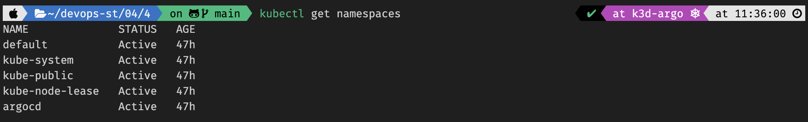

# AsciiArtify

## Project info

## Steps to get access to ArgoCD GUI
1. Open Termaninal and check if you have argocd cluster ```k3d cluster list```.

2. Start your cluster if it's not started yet ```k3d cluster start argo```.

3. Let's check context in which we now ```kubectl config get-contexts``` and we should be in or use ```k3d-argo``` context.

4. Let's check if we have ```argocd``` namespace ```kubectl get namespace```.

5. Now, let's retrieve a secrete/password for our ArgoCD GUI ```kubectl get secret argocd-initial-admin-secret -n argocd -o jsonpath='{.data.password}' | base64 -d; echo```.

6. Let's open ArgoCD GUI.
    - At first we should run ```kubectl port-forward svc/argocd-server -n argocd 8080:443``` to have access from browser to ArgoCD GUI.
    
    - Accept self-signed certificate for and we need to enter ```admin``` as username and ```<PASSWORD>``` as a password (output of step 5).
    
    - When we enter into GUI we will see project ```asciiartify```.
    

Demo video

